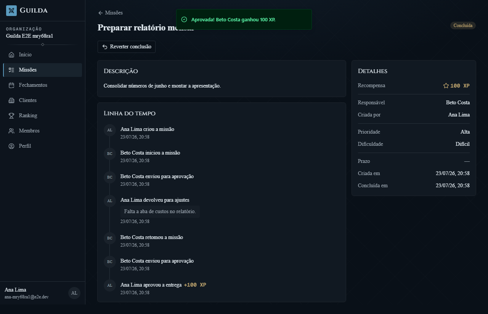
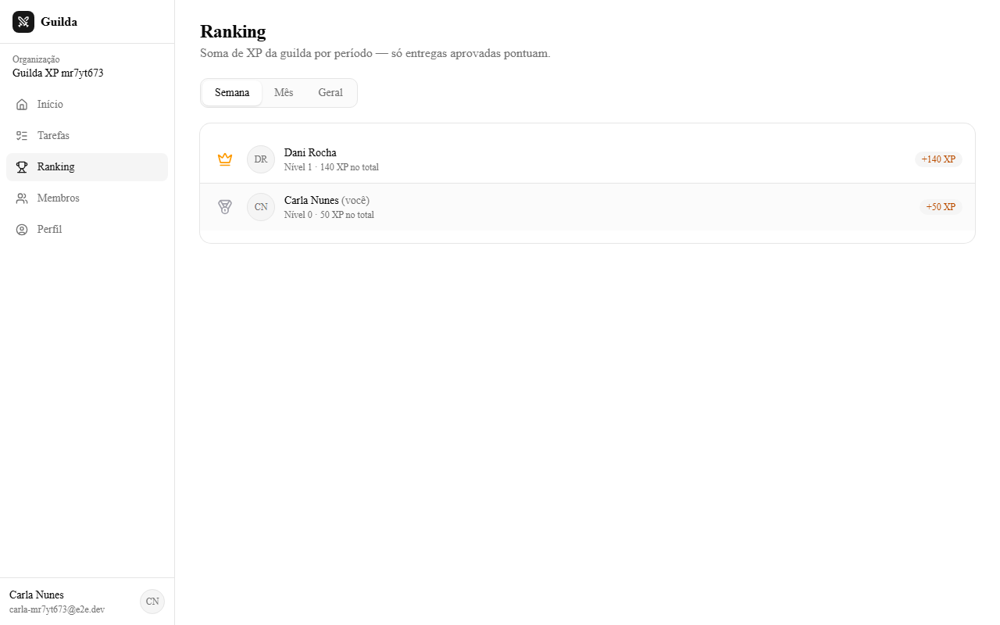
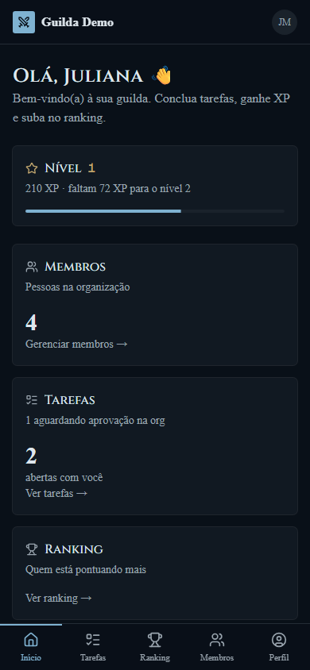
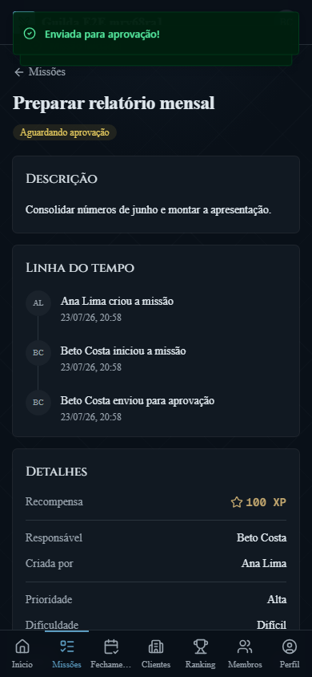
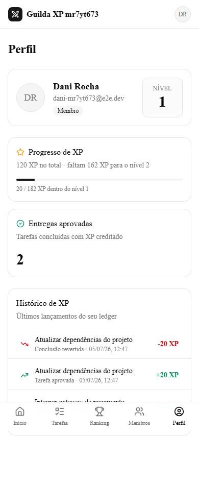

# Guilda — Gestão de Tarefas Gamificada

Plataforma **multi-tenant** de gestão de tarefas com sistema de recompensa:
cada missão concluída vale **XP**, XP acumulado vira **nível**, e o
**leaderboard** mostra quem está carregando a guilda. Cada empresa
(organização) tem usuários, tarefas e ranking totalmente isolados.

> Projeto de portfólio com foco em **segurança em profundidade**:
> Row Level Security no Postgres, ledger imutável de XP e máquina de
> estados validada no servidor.

## Screenshots

| Fluxo de aprovação | Ranking da guilda |
| --- | --- |
|  |  |

| Mobile-first (dashboard, tarefa, perfil) |
| --- |
|    |

## Stack

- **Next.js 16 (App Router) + TypeScript estrito** — full-stack, deploy único
- **Drizzle ORM + PostgreSQL 17** — migrations versionadas + RLS
- **better-auth** com plugin de organizations — sessões, membros, convites por link, papéis
- **Tailwind CSS 4 + shadcn/ui** — mobile-first
- **Zod** validando todo input externo nas Server Actions
- **Vitest** + **Playwright** (E2E com 2 usuários)
- **Docker** (output standalone) + **Caddy** com HTTPS automático

## Decisões de arquitetura

### 1. Isolamento multi-tenant com RLS (defesa em profundidade)

Toda tabela de domínio tem `org_id` e **duas** camadas garantem o isolamento:

1. A aplicação filtra por `org_id` em toda query;
2. O Postgres aplica Row Level Security com política baseada em
   `current_setting('app.org_id')`, setado por transação:

```ts
// src/db/org-tx.ts — toda query de domínio passa por aqui
await tx.execute(sql`SELECT set_config('app.org_id', ${orgId}, true)`);
```

Detalhe importante: **RLS não se aplica a superuser nem ao owner das
tabelas**. Por isso a aplicação conecta com um role dedicado
(`guilda_app`, não-superuser e não-owner), enquanto migrations rodam como
owner. Um `INSERT` cruzando organizações morre no banco com
`new row violates row-level security policy`.

### 2. XP é um ledger imutável

Saldo de XP **nunca sofre UPDATE**. Crédito e estorno são lançamentos
novos em `xp_ledger`:

- Concluiu → `+xp` (`reason = 'task_completed'`), **na mesma transação**
  da transição de status;
- Admin reverteu → `-xp` (`reason = 'reversal'`), sem apagar o crédito;
- Índice único parcial por `task_event_id` torna cada transição
  **idempotente**, permitindo um novo crédito após reversão e reconclusão;
- O role da aplicação tem `UPDATE/DELETE` **revogados** na tabela —
  imutabilidade garantida pelo banco, não por disciplina.

O nível deriva do total: `levelFromXp` puro, com thresholds
`floor(100 · n^1.5)` e testes de borda (0→0, 100→1, 282→2…).

### 3. Máquina de estados no servidor

```
pending → in_progress → completed
   ↘          ↘          ↓ (reversão, admin)
    cancelled  cancelled → in_progress

Legado: in_progress → awaiting_approval → completed | rejected
                                                   ↳ in_progress (retomar)
```

- Só o **responsável** inicia, retoma e conclui diretamente sua missão.
- Estados antigos em `awaiting_approval` continuam operáveis: somente o
  criador ou admin/owner aprova/rejeita; rejeição exige nota.
- O criador ou admin/owner pode cancelar; admin/owner pode reverter conclusão.
- Transições concorrentes serializam com `SELECT … FOR UPDATE`; a
  segunda falha na validação de estado.
- Cada Server Action revalida **sessão + papel + input (Zod)** — a UI
  apenas reflete as permissões, nunca as define.
- Toda transição vira evento em `task_events` (auditoria completa).

### 4. Produção

- **Rate limiting** nas rotas de auth (login 5/min, registro 3/min,
  convite 10/min) com storage no banco;
- **Headers de segurança**: CSP sem `unsafe-eval`, HSTS, `nosniff`,
  `frame-ancestors 'none'` (upgrade natural: CSP com nonce via proxy);
- **Docker multi-stage**: imagem final só com o standalone do Next
  rodando como usuário sem privilégio; serviço `migrate` aplica as
  migrations antes do app subir; **Caddy** cuida do TLS.

## Rodando localmente

Pré-requisitos: Node 22+, Docker.

```bash
cp .env.example .env          # ajuste BETTER_AUTH_SECRET (openssl rand -base64 32)
npm install
npm run db:up                 # Postgres 17 em container (cria o role guilda_app)
npm run db:migrate            # aplica migrations (como owner)
npm run seed                  # organização demo com tarefas e XP (opcional)
npm run dev
```

Logins da demo (senha `demo123456`):

| Papel  | E-mail                  |
| ------ | ----------------------- |
| owner  | helena@demo.guilda.dev  |
| admin  | rafael@demo.guilda.dev  |
| member | juliana@demo.guilda.dev |
| member | tiago@demo.guilda.dev   |

### Testes

```bash
npm test             # domínio, clãs, IA, Telegram e integrações puras
npm run build && npm start
npm run e2e:phase2   # fluxo completo de aprovação com 2 usuários (Playwright)
npm run e2e:phase3   # gamificação: crédito, níveis, ranking, reversão
```

## Deploy na VPS

```bash
cp .env.production.example .env   # DOMAIN, senhas e BETTER_AUTH_SECRET
docker compose up -d --build --remove-orphans
```

Sobe Postgres (com role dedicado), roda as migrations, inicia o app
standalone e o Caddy publica `https://$DOMAIN` com certificado
automático. Postgres já provisionado fora do Docker? Remova o serviço
`db` e aponte as URLs — instruções no próprio `docker-compose.yml`.
A migration `0022` deve entrar antes da nova imagem do app, pois o hook de
criação de organização já inicializa os cinco clãs.

### Telegram (opcional, sem IA)

1. Crie um bot pelo `@BotFather` e copie o token para
   `TELEGRAM_BOT_TOKEN` no `.env`.
2. Aplique as migrations e suba o serviço normalmente. A imagem da Guilda
   inicia a aplicação e o `telegram-worker` juntos; o worker recebe comandos
   por long polling, entrega a fila com retry e agenda lembretes/resumos. Assim
   o vínculo funciona também em painéis que constroem apenas o `Dockerfile` e
   não executam o `docker-compose.yml`.
3. Cada pessoa acessa **Perfil → Telegram** e abre o link temporário para
   conectar sua conversa privada.

O bot opera somente com informativos classificados por IA. O `/start` existe
apenas no deep link técnico que conecta a conta; não há menu nem comandos
operacionais. Os botões enviados em notificações continuam movimentando
missões. Sem `TELEGRAM_BOT_TOKEN`, aplicação e worker continuam operando
normalmente, com a integração inativa. Em desenvolvimento,
rode `npm run telegram:worker` junto do app. Para usar webhook em vez de long
polling, defina `TELEGRAM_UPDATE_MODE=webhook`; esse modo exige uma URL pública
HTTPS (use um túnel ao testar localmente).

Em produção, mantenha uma única réplica do serviço com polling. Os logs do
container devem mostrar `Telegram worker iniciado em modo polling` e
`Recepção do Telegram configurada por long polling` logo após a inicialização.

### IA: mensagens empresariais → missões

Com `ANTHROPIC_API_KEY` configurada, qualquer membro conectado pode escrever ao
bot em linguagem natural. A mensagem precisa informar a ação e os responsáveis;
quando o trabalho estiver ligado a um cliente, também deve trazer o nome da
empresa. Não há cabeçalho, ordem, rótulos ou formatação obrigatórios. Por exemplo:

```text
Fiz a abertura da PICCOLI AGRO SERVIÇOS LTDA. O Bruno deve encaminhar na
prefeitura e solicitar o certificado digital.
```

Cada ação independente vira uma missão para o responsável informado. Se faltar
uma informação essencial, o bot pede que a pessoa complemente a mensagem; nomes
ambíguos ou inexistentes bloqueiam a confirmação.

Solicitações gerais também são aceitas, como `Bruno, organize os documentos
internos até sexta`. Uma solicitação como `Bruno, fecha o balanço da Scharff até
31/07` cria um item pendente em **Períodos e demandas**; ao concluir (ou aprovar
uma entrega legada), a
missão, somente esse período é marcado como fechado. O encerramento do ano
inteiro só é vinculado quando a mensagem disser explicitamente `encerramento
anual`, `exercício inteiro` ou um intervalo anual completo. A prévia sempre
mostra qual dos dois controles será afetado antes da confirmação.

O bot usa Claude Sonnet com Structured Outputs para interpretar a intenção,
extrair empresa, alteração, ações e responsáveis, resolver os nomes contra os
membros reais da Guilda e mostrar uma prévia. A
criação só acontece depois de tocar em **Criar missões**; nomes não reconhecidos
bloqueiam a confirmação. Se o cliente já existe, as missões ficam vinculadas a
ele; nos informativos detalhados de novo cliente, o cadastro é feito
automaticamente quando CNPJ e regime forem válidos. Caso contrário, a prévia avisa e permite criar as missões sem
vínculo. Para responsáveis múltiplos (`Rafa/Bruno`), é criada uma missão para
cada pessoa. Itens meramente informativos como “segue sem alterações” não viram
missão.

## Estrutura

```
src/
  domain/        máquina de estados + XP/níveis (puros, testados)
  db/            schema Drizzle, migrations (incl. RLS), withOrgTx
  lib/           auth (better-auth), sessão, queries de XP/leaderboard
  app/
    (auth)/      login e cadastro (com aceite de convite)
    (app)/       dashboard, tarefas, ranking, membros, perfil
    invite/[id]  página pública do convite
  proxy.ts       proteção de rotas (checagem otimista de cookie)
scripts/         seed de demonstração + E2E Playwright
docker/          init do Postgres (roles) + Caddyfile
```

## Fora do escopo da v1

Badges/conquistas, notificações, tarefas recorrentes, calendário,
comentários, billing — decisões registradas no `CLAUDE.md`.
