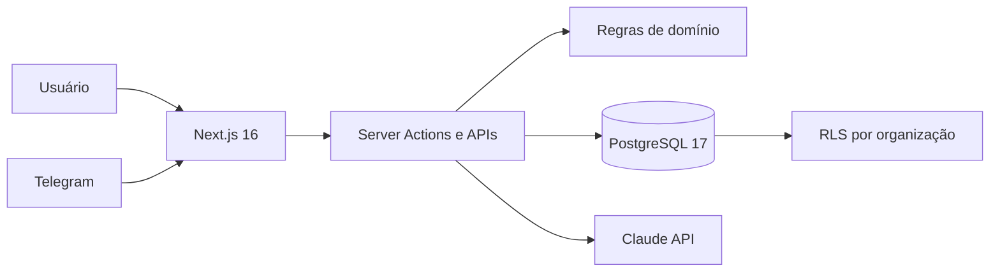

# Guilda

Plataforma operacional multi-tenant para escritórios contábeis. O Guilda reúne
missões, clientes, clãs especializados, controles fiscais e contábeis,
informativos e automações em uma única aplicação.

[](https://github.com/Bruno-I-A/guilda/actions/workflows/pipeline.yml)


> O projeto está entrando em operação real. Dados, segredos e bancos de
> produção não fazem parte deste repositório.

## O que o sistema resolve

- Organiza o trabalho em clãs: Fiscal, Contabilidade, RH, Societário,
  Financeiro e Sucesso do Cliente.
- Distribui missões, acompanha estados, registra auditoria e premia entregas
  com XP e níveis.
- Mantém cadastro de empresas com consulta de CNPJ e isolamento por organização.
- Controla carteira e fichas fiscais, competências mensais, parcelamentos,
  honorários e declarações anuais do MEI.
- Acompanha fechamentos contábeis e distribuição de lucros.
- Conduz fluxos societários de abertura, alteração e baixa de empresas.
- Transforma informativos em trabalho estruturado com apoio de IA e Telegram.

## Visão rápida

| Fluxo de aprovação | Ranking da Guilda |
| --- | --- |
|  |  |

| Experiência mobile |
| --- |
|    |

## Arquitetura



Decisões importantes:

- Next.js App Router e TypeScript estrito no mesmo deploy;
- PostgreSQL e Drizzle ORM com migrations versionadas;
- Row Level Security baseada em `org_id`, além dos filtros da aplicação;
- Better Auth para sessões, organizações, papéis e convites;
- máquina de estados e permissões validadas no servidor;
- ledger imutável para XP e trilha de eventos para auditoria;
- Docker multi-stage, processo sem privilégio e HTTPS no proxy da hospedagem.

Veja os detalhes em [Arquitetura](docs/architecture.md) e
[Ambientes](docs/environments.md).

## Stack

| Camada | Tecnologia |
| --- | --- |
| Aplicação | Next.js 16, React 19, TypeScript |
| Interface | Tailwind CSS 4, shadcn/ui, Radix UI |
| Dados | PostgreSQL 17, Drizzle ORM |
| Autenticação | Better Auth |
| Validação | Zod |
| Testes | Vitest, Playwright |
| Integrações | Telegram, Claude API, BrasilAPI |
| Operação | Docker, Easypanel, GitHub Actions |

## Executando localmente

Pré-requisitos: Node.js 22+, npm e Docker.

```bash
git clone https://github.com/Bruno-I-A/guilda.git
cd guilda
cp .env.example .env
npm ci
npm run db:up
npm run db:migrate
npm run seed
npm run dev
```

A aplicação estará em `http://localhost:4000`.

O seed **só roda contra banco local**: ele cria uma conta `owner` com senha
conhecida, o que em produção é uma conta administrativa de graça. Ele aborta se
`NODE_ENV=production` ou se a `DATABASE_URL` não apontar para `localhost` —
para ignorar a trava deliberadamente, `ALLOW_SEED=1`. A senha sai de
`SEED_PASSWORD`; sem ela, cai no padrão local `demo123456`.

Contas criadas pelo seed local (senha: o valor de `SEED_PASSWORD`, ou `demo123456` por padrão):

| Papel | E-mail |
| --- | --- |
| Owner | `helena@demo.guilda.dev` |
| Admin | `rafael@demo.guilda.dev` |
| Membro | `juliana@demo.guilda.dev` |
| Membro | `tiago@demo.guilda.dev` |

Essas credenciais existem apenas na base fictícia criada pelo seed.

## Qualidade

```bash
npm test
npm run lint
npx tsc --noEmit
npm run build
```

A pipeline executa as quatro verificações em todo push para `develop` e em
Pull Requests destinados a `main`.

## Ambientes e publicação

| Branch | Ambiente | Publicação |
| --- | --- | --- |
| Branch de trabalho | Desenvolvimento local | Não publica |
| `develop` | Homologação isolada | Após a pipeline |
| `main` | Produção real | Acionamento manual após aprovação |

O procedimento, os cuidados com migrations e a separação dos bancos estão em
[docs/environments.md](docs/environments.md).

## Estrutura do projeto

```text
src/
  app/          páginas, layouts, APIs e Server Actions
  components/   componentes compartilhados de interface
  db/           schema, migrations e transações com contexto da organização
  domain/       regras de negócio puras e testáveis
  lib/          autenticação, integrações e serviços de aplicação
scripts/        seed, workers, auditorias e testes E2E
docker/         inicialização dos ambientes Docker
docs/           arquitetura, ambientes e imagens
```

## Contribuição e segurança

- Leia [CONTRIBUTING.md](CONTRIBUTING.md) antes de propor uma alteração.
- Vulnerabilidades não devem ser abertas como issue pública; siga
  [SECURITY.md](SECURITY.md).
- `.env`, tokens, dumps de banco e dados de clientes nunca devem ser commitados.

## Licença

Uma licença de redistribuição ainda não foi definida. O código está público
para avaliação técnica; a ausência de uma licença mantém reservados os demais
direitos autorais.
