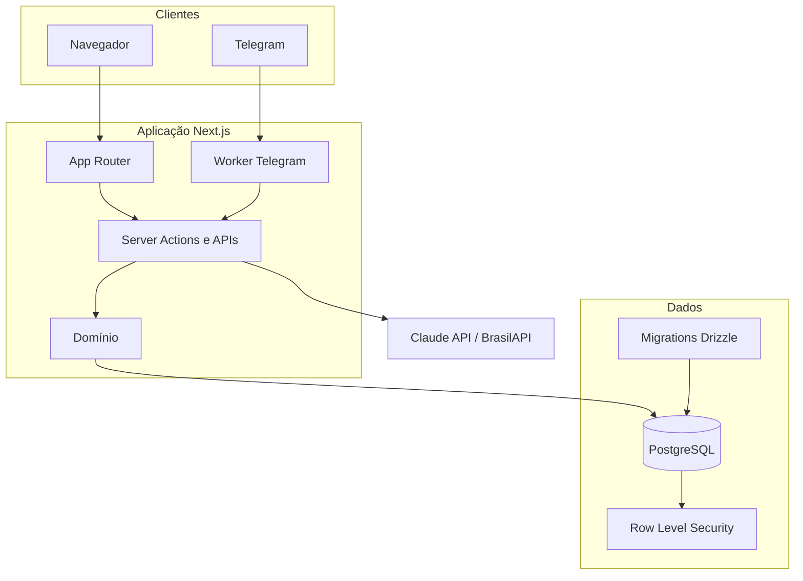

# Arquitetura do Guilda

## Limites do sistema

O Guilda é uma aplicação full-stack Next.js. A interface, as Server Actions e
as rotas HTTP são entregues pelo mesmo artefato. O PostgreSQL é o sistema de
registro; integrações externas enriquecem ou transportam informação, mas não
substituem as regras de domínio.

## Multi-tenancy e autorização

Toda tabela de domínio carrega `org_id`. O isolamento acontece em duas camadas:

1. queries da aplicação filtram a organização ativa;
2. políticas RLS no PostgreSQL verificam `current_setting('app.org_id')`.

As queries de domínio passam por `withOrgTx`, que abre uma transação e define o
contexto da organização. A aplicação conecta como `guilda_app`, role sem
privilégio de superuser e diferente do owner das tabelas, para que o RLS seja
efetivo. Migrations usam uma conexão de owner separada.

Papéis e participação nos clãs são novamente carregados no servidor em cada
operação sensível. Valores enviados pela interface nunca são aceitos como prova
de autorização.

## Organização do domínio

- `src/domain`: funções puras, estados, permissões e validações centrais;
- `src/lib`: orquestração, integrações e serviços reutilizáveis;
- `src/app`: leitura para as telas e fronteiras de mutação;
- `src/db`: modelo relacional, migrations, RLS e contexto transacional.

As áreas operacionais compartilham o cadastro de clientes, mas preservam seus
próprios controles. Por exemplo, MEIs não entram nas fichas fiscais mensais:
possuem um controle anual exclusivo de DASN-SIMEI.

## Integridade e concorrência

- transições de missão usam locks e uma máquina de estados no servidor;
- XP é um ledger de lançamentos, sem atualização destrutiva de saldo;
- chaves compostas com `org_id` impedem referências entre organizações;
- índices únicos tornam imports e eventos importantes idempotentes;
- eventos preservam quem realizou alterações operacionais;
- migrations incluem políticas RLS e permissões do role da aplicação.

## Autenticação e segredos

Better Auth gerencia sessões, organizações, membros, papéis e convites. Segredos
são fornecidos apenas por variáveis de ambiente. Credenciais Gov.br permitidas
pelo Fluxo Societário são cifradas antes da persistência; a chave nunca fica no
banco nem no repositório.

## Processos de produção

O container final executa:

1. migrations com `MIGRATION_DATABASE_URL`;
2. aplicação Next.js com `DATABASE_URL` restrita;
3. worker do Telegram, quando configurado.

Uma falha de migration impede a aplicação de iniciar com schema incompatível.
Produção e homologação usam serviços, bancos, volumes e segredos independentes.

